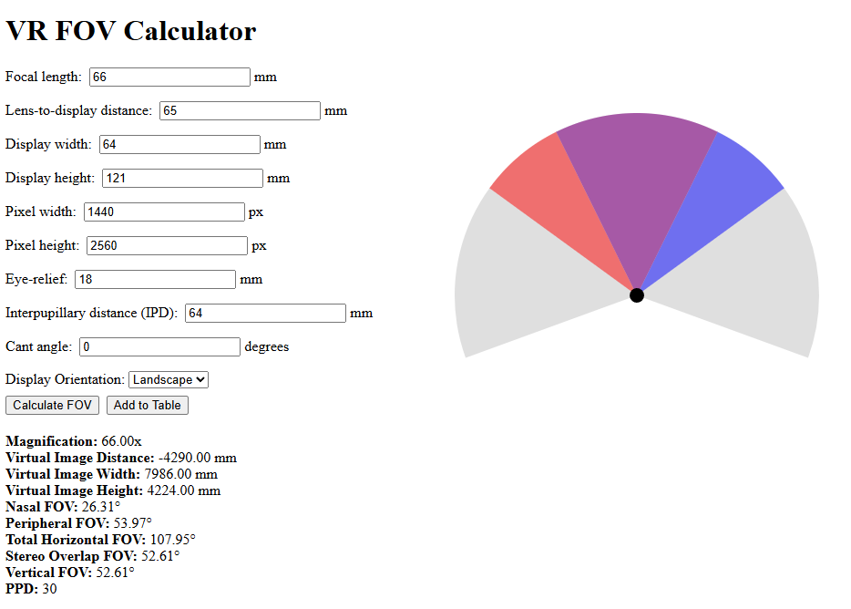

# VR Headset Fov Calculator


This tool estimates field-of-view (FOV) parameters for a VR headset using the following underlying assumptions:
* The displays are touching each other right in between the eyes.
* The lenses are also touching each other in the nasal part 
* The lenses are near perfect thin lenses with "nice behavior"

The formulas for FOV are derived from the [UW paper on wide FOV analysis](https://courses.cs.washington.edu/courses/cse490v/20wi/public/report_14.pdf) which is partly aligned with [Risa2000’s FOV documentation](https://risa2000.github.io/vrdocs/docs/hmd_fov_calculation.html).

While commercial headset designs require more complex models due to non-trivial optics, this calculator helps derive ballpark values from a simplified model to understand basic principles, visualize trade-offs, and build intuition around core layout parameters.

## Setup

Install dependencies:
```
npm i
```
Start the server:
```
npm run dev
```